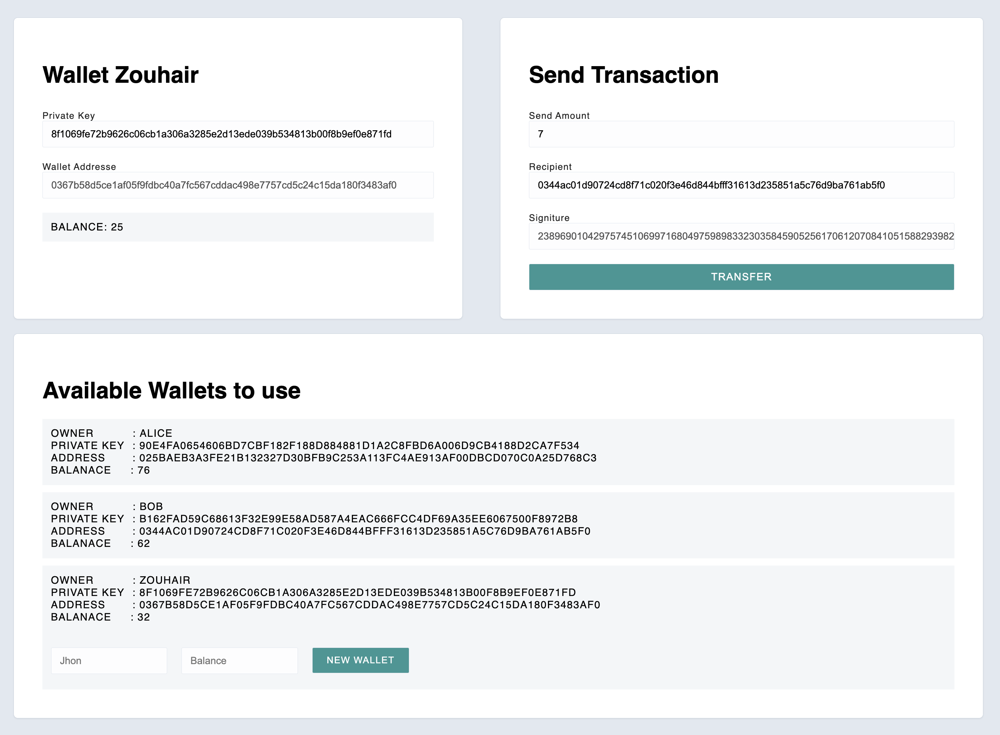

# ECDSA Node

This project demonstrates the use of a client-server architecture to facilitate transfers between different addresses. While the backend server handles all transfers, making it centralized, the focus is on integrating Public Key Cryptography. Using Elliptic Curve Digital Signatures (ECDSA), the server ensures that only transfers signed by the owner of an associated address are processed. This enhances security by tying transactions to cryptographic signatures.

## Key Features

- Public Key Cryptography integration.
- Elliptic Curve Digital Signatures for transaction validation.
- Secure transfer mechanism requiring signed messages.
- Recovery of public keys from signatures.

## What I Learned

Working on this project allowed me to:

- Utilize the **ethereum-cryptography** library.
- Hash and sign messages securely.
- Perform balance transfers between addresses.
- Recover public keys from signatures to verify ownership.

## Project Screenshot

Below is a screenshot of the project interface:



### Features Demonstrated:

- Users can create new wallets and add balance.
- Private keys are used to retrieve wallet balances in the "Wallet" section.
- In the "Transfer" section, users can specify an amount, recipient address, and generate a signature.
- The generated signature, along with the transaction payload, is sent to the backend for verification. The backend verifies the signature, recovers the public key, and completes the transaction securely.

## Video Instructions

For an overview of this project and instructions on getting started, check out the following video: [Project Overview Video](https://www.loom.com/share/0d3c74890b8e44a5918c4cacb3f646c4)

---

## Client Setup

The client is a React application powered by Vite. Follow these steps to run it:

1. Open a terminal in the `/client` folder.
2. Install dependencies by running:
   ```bash
   npm install
   ```
3. Start the application:
   ```bash
   npm run dev
   ```
4. Visit the app in your browser at [http://127.0.0.1:5173/](http://127.0.0.1:5173/).

---

## Server Setup

The server is built with Node.js and uses Express. Follow these steps to set it up:

1. Open a terminal in the `/server` folder.
2. Install dependencies by running:
   ```bash
   npm install
   ```
3. Start the server:
   ```bash
   node index
   ```
4. The application will connect to the default server port (3042) automatically.

### Tip

Use **nodemon** instead of `node` to automatically restart the server when changes are made:

```bash
npm install -g nodemon
nodemon index
```

---

This project serves as an excellent introduction to Public Key Cryptography and secure transaction mechanisms. By implementing features like hashing, signing, and verifying signatures, I gained practical experience with core cryptographic principles essential for modern decentralized applications.

